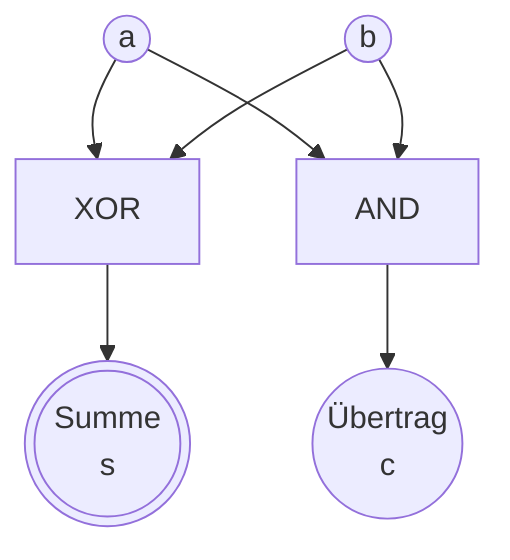
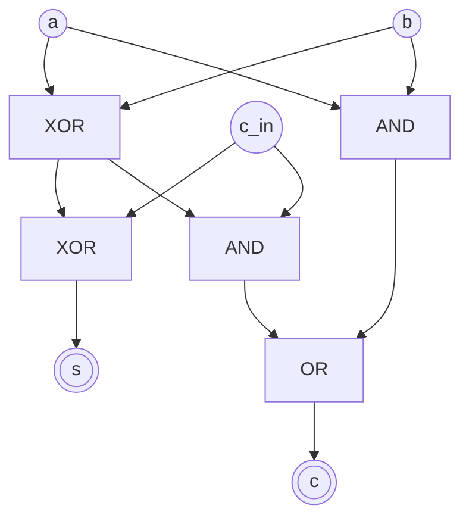
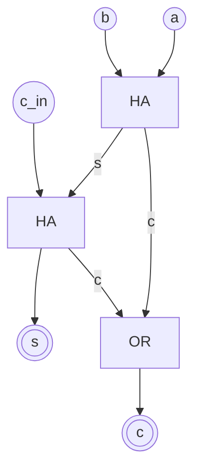
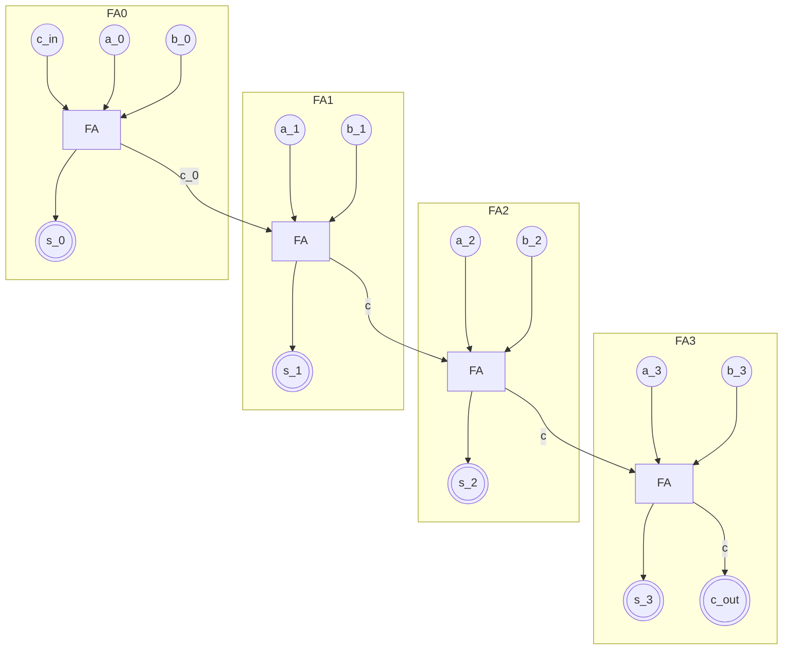

Nachdem wir zuletzt geklärt haben, wie wir Einsen und Nullen mit Logikgattern darstellen können, wollen wir uns jetzt anschauen, wie wir mit diesen Bits rechnen können.
Und das ist einfacher, als man vielleicht denkt.

## Addieren mit 1 Bits
Schauen wir uns zuerst an, wie eine simple Addition mit einer Stelle funktioniert.

| $a$ | $b$ | $a + b$ |
|-----|-----|---------|
| $0$ | $0$ |     $0$ |
| $0$ | $1$ |     $1$ |
| $1$ | $0$ |     $1$ |
| $1$ | $1$ |    $10$ |

Nun, bis jetzt haben wir nur mit einzelnen Bits gerechnet, aber das Ergebnis von 1 + 1 ist 10, also zwei Bits.
Darum machen wir uns gleich Gedanken.  
Aber wenn man nur die hinteren Stellen betrachtet, fällt etwas auf: 

**Die Addition von $a$ und $b$ entspricht genau der Funktion eines XOR-Gatters.**

Und wenn wir uns den Übertrag ansehen, der im Fall von 1 + 1 entsteht, sehen wir, dass dieser genau dann 1 ist, wenn sowohl $a$ als auch $b$ 1 sind.

**Der Übertrag entspricht genau der Funktion eines UND-Gatters.**

Am Ende können wir also sagen, dass eine Addition von zwei Bits $a$ und $b$ folgendes ergibt:
- Das Ergebnis-Bit ist $a$ XOR $b$.
- Der Übertrag ist $a$ UND $b$.

Wenn wir das nun als Schaubild darstellen, sieht das so aus:

Damit können wir schon die Binärzahlen mit einer Stelle addieren!

Nun haben wir aber vielleicht auch gigantische Zahlen, wie 4 oder 7!
Dafür brauchen wir mehr als ein Bit.
Aber das Prinzip bleibt das gleiche.
Nur, dass wir nun auch noch den Übertrag beachten müssen.  

Aber halb so wild, denn was macht man mit einem Übertrag im normalen schriftlichen Addieren?  
Man addiert ihn einfach zur nächsten Stelle dazu!
Machen wir das also auch hier.
Statt nur $a$ und $b$ zu addieren, addieren wir nun $a$, $b$ und den Übertrag $c_{in}$ der vorherigen Stelle:

| $a$ | $b$ | $c_{in}$ | $s$ | $c_{out}$ |
|-----|-----|----------|-------|-----------|
| $0$ | $0$ |    $0$   | $0$ |    $0$    |
| $0$ | $0$ |    $1$   | $1$ |    $0$    |
| $0$ | $1$ |    $1$   | $0$ |    $1$    |
| $0$ | $1$ |    $1$   | $0$ |    $1$    |
| $1$ | $0$ |    $0$   | $1$ |    $0$    |
| $1$ | $0$ |    $1$   | $0$ |    $1$    |
| $1$ | $1$ |    $0$   | $0$ |    $1$    |
| $1$ | $1$ |    $1$   | $1$ |    $1$    |

Unser Schaltplan, sieht dann wieder genauso aus, nur dass wir jetzt noch einen weiteren Eingang für den Übertrag haben:

Das Ganze nennt man dann einen Volladdierer.
Das vorher (ohne Übertragseingang) ist ein Halbaddierer.  
Wir sehen hier auch, dass unser Volladdierer (FA) aus zwei Halbaddierern (HA) und einem ODER-Gatter besteht:

> [!Info] 
> Das ist ein Vorgeschmack darauf, wie es weitergeht - wir erdenken uns Baublöcke und kombinieren sie, um komplexere Funktionen zu bauen.
> Hier wird eben aus einfachen Logikgattern erst ein Halbaddierer und daraus dann ein Volladdierer.

## Größere Zahlen addieren

Normalerweise kommt ein Rechner auch in die Verlegenheit, mehr als ein Bit addieren zu müssen.
Auch hier können wir uns aber anschauen, wie wir das mit Stift und Papier machen.  
Bei mehrstelligen dezimalen Zahlen rechnen wir von hinten nach vorn die einzelnen Stellen zusammen, wobei wir den Übertrag der vorherigen Stelle mit einbeziehen.
Und genau so machen wir das auch im Binären.

Wenn wir nun also zwei 4-Bit-Zahlen addieren wollen, brauchen wir 4 Volladdierer, die hintereinander geschaltet und deren Überträge miteinander verbunden sind:

    

    

> [!info] Nomenklatur
> Wie gerade schon gesehen, werden die Bits von rechts nach links durchnummeriert, beginnend mit 0.
> Das von hinten nach vorn zu machen hat gleichzeitig den Vorteil, dass die Nummerierung der Bits mit der Potenz von 2 übereinstimmt, die sie repräsentieren.  
> Zu merken ist aber einfach nur: $a_0$ ist das niederwertigste Bit ganz rechts.

Heraus kommt eine Form, die ein wenig aussieht wie ein Wasserfall, würde man es direkt nebeneinander rendern, käme würde der Übertrag eine Art "Welle" darstellen.
Daher nennt man diese Form auch Ripple-Carry-Adder, da der Übertrag von einem Volladdierer zum nächsten "rippelt".

Aber was macht denn das c_in dort eigentlich noch?
Normalerweise hat man ja keinen Übertrag in der ersten Stelle, oder?  
Prinzipiell richtig.
Beim Addieren ist dieser Eingang normalerweise auch 0, aber er hilft später noch richtig, wenn wir nicht nur addieren, sondern auch subtrahieren wollen.

## Die Andere Richtung

Subtrahieren müssen wir natürlich auch können.
Wie negative Zahlen dargestellt werden, haben wir im [vorherigen Kapitel](0-2_einmal_zahlen_bitte.mdx) schon geklärt, aber wie subtrahieren wir eigentlich?
Nun hilft uns das kompliziert aussehende Zweierkomplement, denn es stellt sich heraus, dass die Subtraktion von $b$ von $a$ genau der Addition von $a$ und dem Zweierkomplement von $b$ entspricht.
Das Zweierkomplement zu bilden ist nicht schwer und wird noch einfacher wenn, wir nun unseren Addierer mit $c_{in}$ haben.

Grundsätzlich sieht die Mathe so aus:
$$a - b = a + (-b) = a + (\overline{b} + 1)$$  
Was jetzt auffällt ist das $+1$ am Ende.
Das ist genau das, was wir mit $c_{in}$ machen können, denn wenn wir $c_{in}$ auf 1 setzen, addieren wir genau die $1$, die wir brauchen.  
An dem Punkt müssen wir gar nichts weiter tun, als unser $b$ nur zu invertieren und $c_{in}$ auf 1 zu setzen, um die Subtraktion durchzuführen.

Und jetzt wird es wild: Das wird noch einfacher!
Wir können nämlich einfach vor jeden Eingang von $b$ ein XOR-Gatter setzen, das mit $c_{in}$ verbunden ist.
Wenn $c_{in}$ 0 ist, passiert nichts, wir addieren also normal.
Wenn $c_{in}$ aber 1 ist, wird jedes Bit von $b$ invertiert, was genau das ist, was wir brauchen, um die Subtraktion durchzuführen.

Wer mag, kann sich das gern mal aufmalen, aber das Ergebnis ist ein Addierer, der sowohl addieren als auch subtrahieren kann, je nachdem, ob $c_{in}$ 0 oder 1 ist.

## Achtung, Vorzeichen!

Der letzt Satz des vorherigen Kapitels hat es schon angedeutet, aber hier müssen wir aufpassen, denn das Problem ist für eine ganze Menge Sicherheitslücken und Fehler verantwortlich:  
Angenommen, ich rechne mit 8-Bit-Zahlen mit Vorzeichen und möchte $127 + 1$ rechnen?  
Die Binärdarstellung von $127$ ist $01111111_2$.  
Wenn ich nun 1 addiere, erhalte ich $10000000_2$, was im Zweierkomplement $-128$ entspricht.  
Das ist natürlich nicht das, was wir erwartet haben, aber es ist das, was unser Addierer ausspuckt.
Das Ganze nennt man einen "Integer Overflow" und zusammen mit dem Underflow (wenn zwei negative Zahlen eine positive ergeben) ist er ein großes Problem, da es zu unvorhergesehenen Ergebnissen führen kann.

Daher sollten wir immer Folgendes prüfen:
- Wenn wir zwei positive Zahlen addieren, sollte das Ergebnis positiv sein, sonst haben wir einen Overflow.
- Wenn wir zwei negative Zahlen addieren, sollte das Ergebnis negativ sein, sonst haben wir einen Underflow.
  
Und die Behauptung ist: Wenn das Vorzeichen zweier Zahlen gleich ist, aber ungleich des Vorzeichens des Ergebnisses, dann ist ein Überlauf aufgetreten.

Nehmen wir wieder an, wir sind im Bereich 8bit signed und stellen einmal die Tabelle auf, um das zu überprüfen:

| $a_8$ | $b_8$ | $s_8$ | Overflow? ($o$) |
|-------|-------|-------|-----------|
|  $0$  |  $0$  |  $0$  |    Nein   |
|  $0$  |  $0$  |  $1$  |     Ja    |
|  $0$  |  $1$  |  $0$  |    Nein   |
|  $0$  |  $1$  |  $1$  |    Nein   |
|  $1$  |  $0$  |  $0$  |    Nein   |
|  $1$  |  $0$  |  $1$  |    Nein   |
|  $1$  |  $1$  |  $0$  |     Ja    |
|  $1$  |  $1$  |  $1$  |    Nein   |

Das ist sogar gleich mal eine Übung in Logik, wie wir aus der Tabelle jetzt eine Formel für die Überlaufbedingung ableiten können.
Die Formel lautet:
$$o = (a_8 \land b_8 \land \lnot s_8) \lor (\lnot a_8 \land \lnot b_8 \land s_8)$$

Nun können wir sicher sein, dass wir immer die richtigen Ergebnisse bekommen, wenn wir die Überlaufbedingung überprüfen und entsprechend handeln, wenn sie erfüllt ist.

Im nächsten Kapitel schauen wir uns an, wie wir aus diesem einfachen Rechner eine vollwertige Logikeinheit bauen können.

Zusatzaufgabe: Multiplikation

Etwas komplizierter, aber gar nicht so schwer, ist die Multiplikation.
Wer möchte kann sich an dieser Stelle gerne selbst mal überlegen, wie so etwas zumindest in der Theorie aufgebaut sein könnte.
Die simpelste Variante könnte so aussehen wie eine Treppe, wenn man es sich aufmalt.

Ein Dividierer wiederum ist hochkompliziert...

